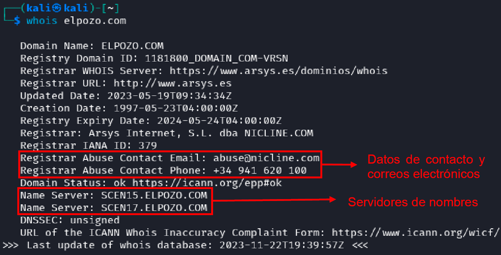
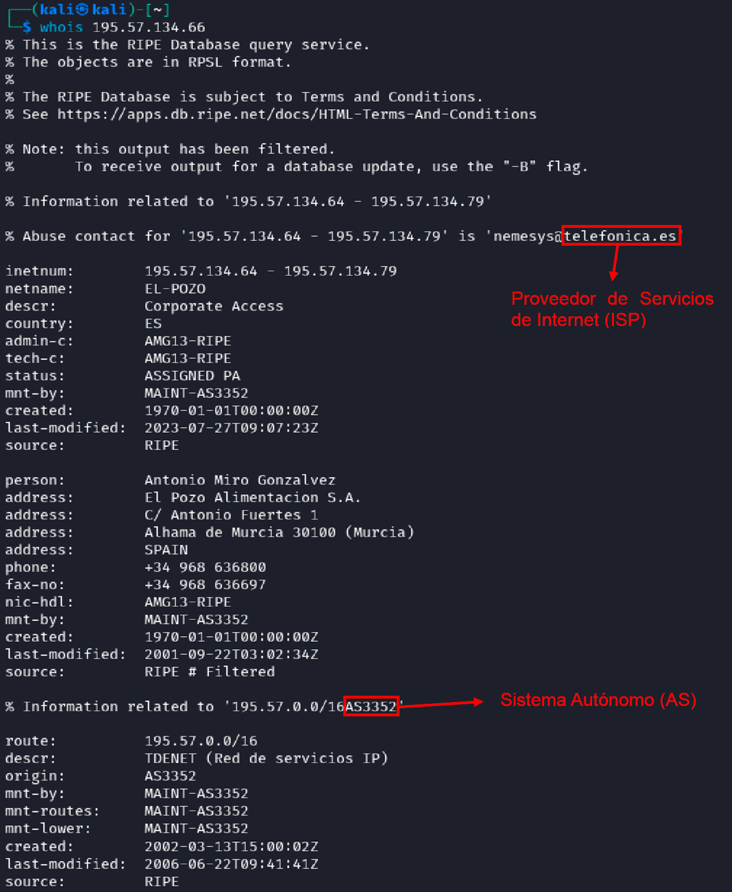
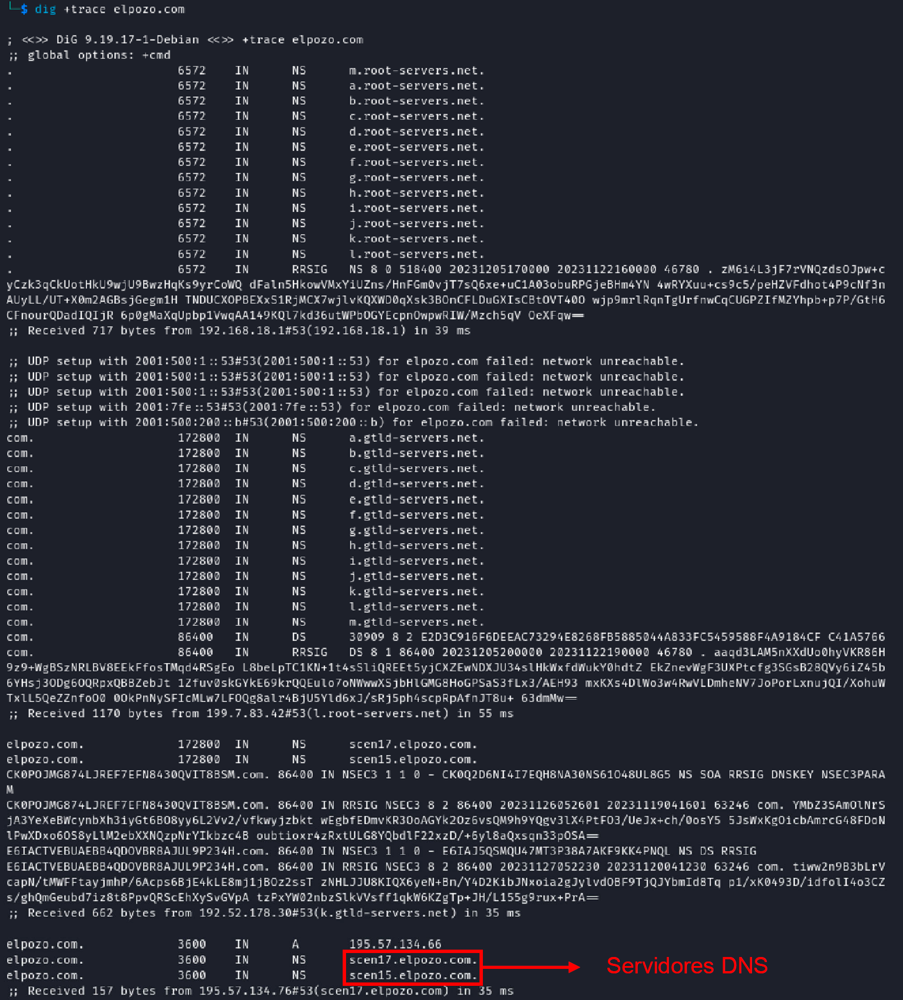
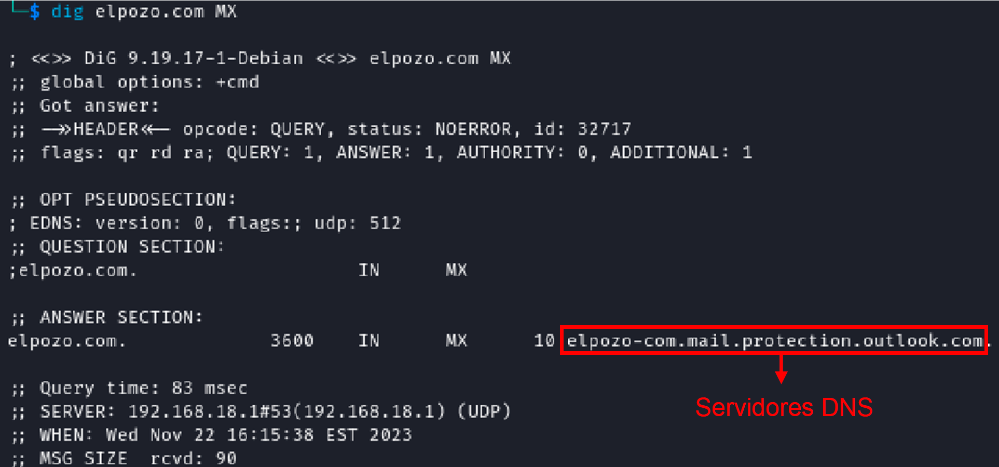
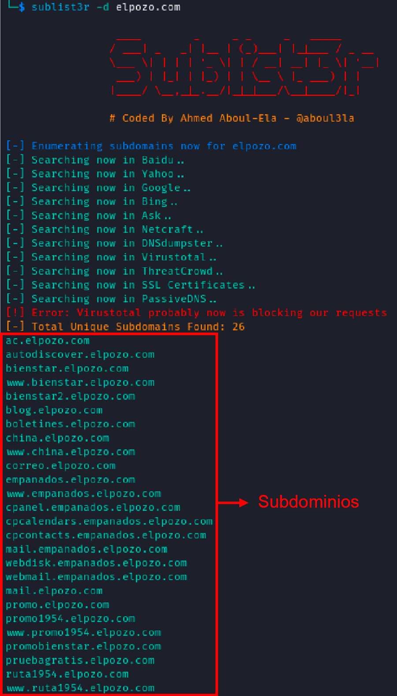
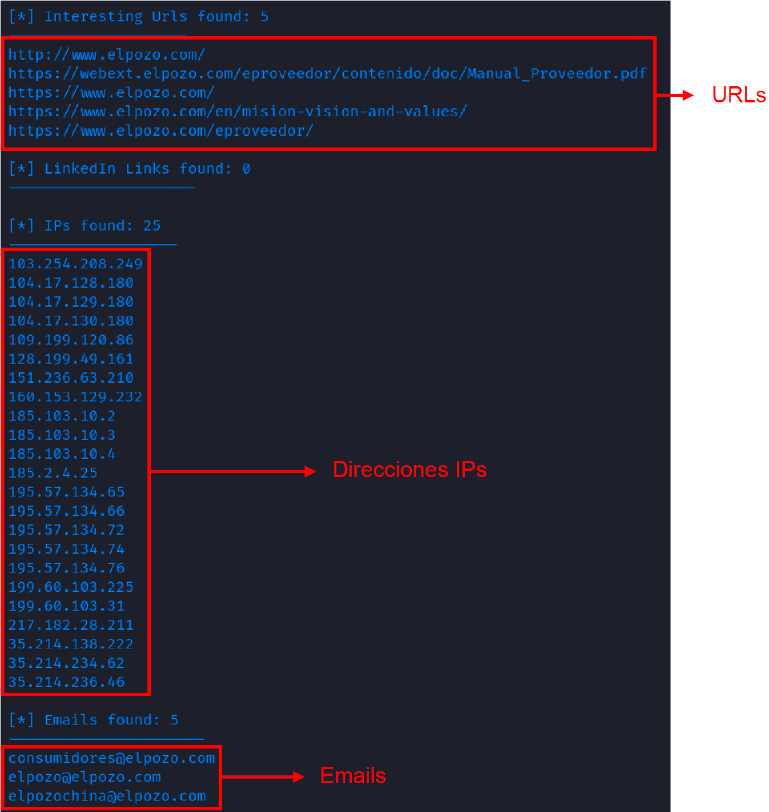
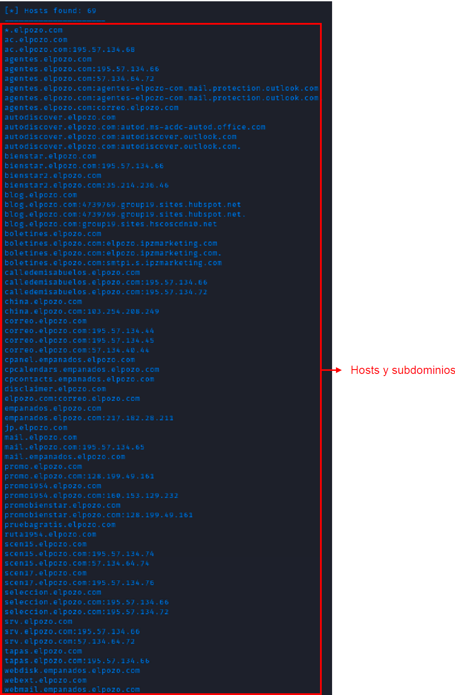

# **Informe de Auditoría OSINT para \"El POZO\"**

## **Introducción**

Este informe documenta la auditoría OSINT realizada para la empresa \"El
POZO\". Se han utilizado diversas herramientas y técnicas para recopilar
información crucial sobre la infraestructura de la empresa. El objetivo
es identificar posibles vulnerabilidades y fortalecer las medidas de
seguridad.

## **1. Información Whois**

**Herramienta Utilizada**: Comando whois.

**Proceso**: En la consola de comandos de Kali Linux, se ejecutó el
comando "whois elpozo.com" para obtener información detallada sobre la
empresa El pozo. Además, para obtener la información sobre AS (Sistema
autónomo) y ISP (Proveedor de servicios de internet), mediante el
comando whois pero colocando a continuación la dirección IP de
elpozo.com obtenida con el comando "dig elpozo.com".

**Resultado:** Hemos encontrado la siguiente información especificada
abajo en la imagen, en la cual hemos obtenido información relevante a
servidores de nombre, datos de contacto como número de teléfono y email.
Y en la imagen posterior encontramos la información AS (Sistema
autónomo) y ISP (Proveedor de servicios de internet), donde el número de
sistema autónomo es es AS3352. Y su proveedor de servicios de internet
es Telefónica de España.

## **2. Servidores DNS**

**Herramienta utilizada:** Comando dig +trade elpozo.com

**Proceso:** En la consola de comandos de Kali Linux, se ejecutó el
comando "dig +trace elpozo.com" para obtener información detallada sobre
los dns de la empresa El pozo.

**Resultado:** En la imagen mostrada a continuación, vemos los
servidores DNS específicos de El pozo. El proceso de identificación de
los servidores DNS de \"El POZO\" implica el uso del comando dig +trace
elpozo.com. Esta técnica de rastreo DNS muestra una jerarquía de
servidores, comenzando con servidores raíz globales y avanzando hacia
los servidores específicos. Finalmente, se identificaron los servidores
DNS específicos para el dominio elpozo.com: scen17.elpozo.com y
scen15.elpozo.com.

## **3. Servidores de Correo**

**Herramienta utilizada:** Comando dig elpozo.com MX.

**Proceso:** En la consola de comandos de Kali Linux, se empleó el
comando "dig elpozo.com MX" para obtener información detallada sobre los
servidores de correo de la empresa El pozo.

**Resultado:** En la imagen que a continuación se muestra el servidor de
correo de El pozo. El registro MX apunta a
elpozo-com.mail.protection.outlook.com. Esto indica que \"El POZO\"
utiliza los servicios de correo de Microsoft Exchange Online Protection
para su correo electrónico. Este servicio es parte de Office 365 y
proporciona seguridad y protección contra spam y malware.

## **4. Subdominios**

**Herramienta utilizada:** Sublist3r.

**Proceso:** En la consola de comandos de Kali Linux, colocamos el
comando "sublist3r -d elpozo.com" para obtener información sobre los
subdominios de la empresa El pozo.

**Resultado:** En la imagen de abajo se muestran todos los subdominios
relacionados con el dominio principal de El pozo. El registro obtenido
se ha localizado varios tipos de subdominios, subdominios de servicios
internos y externos, subdominios relacionados con sitios web y blog,
subdominios de campañas promocionales, entre otros. En la imagen de
abajo mostramos los 26 dominios encontrados.

## **5. Información Adicional**

**Herramienta utilizada:** Comando theHarvester.

**Proceso:** En la consola de comandos de Kali Linux, colocamos el
comando "theHarvester -d elpozo.com -b all" para recopila información
sobre correos electrónicos, subdominios, hosts, etc., desde varias
fuentes públicas.

**Resultado:** En la imagen de abajo se muestran toda la información
encontrada y que tenga relevancia con El pozo.

Se identificaron varias **URLs**, la página principal, un manual de
proveedor, y otras páginas relacionadas con la empresa. Estas URLs
pueden proporcionar información sobre la estructura de la empresa,
políticas internas y datos que podrían ser útiles para entender mejor la
organización y sus operaciones. Además, pueden ser puntos de entrada
para realizar pruebas de penetración web o para buscar vulnerabilidades.

Se encontraron múltiples **direcciones** **IPs** asociadas con la
empresa. Las direcciones pueden ser utilizadas para mapear la red de la
empresa y entender mejor su infraestructura de internet. Esto es crucial
para identificar posibles debilidades o vulnerabilidades en la red.

Se recopilaron varias **direcciones de correo electrónico**. Las
direcciones de correo electrónico pueden ser objetivos para ataques de
phishing o ingeniería social. Además, pueden proporcionar pistas sobre
la estructura interna de la empresa y sus empleados.

Se identificaron numerosos **hosts y subdominios**. Los subdominios
pueden contener información sensible o ser más vulnerables a ataques.
Comprender la estructura de subdominios de la empresa puede revelar
áreas no protegidas adecuadamente o sistemas internos accesibles desde
internet.

